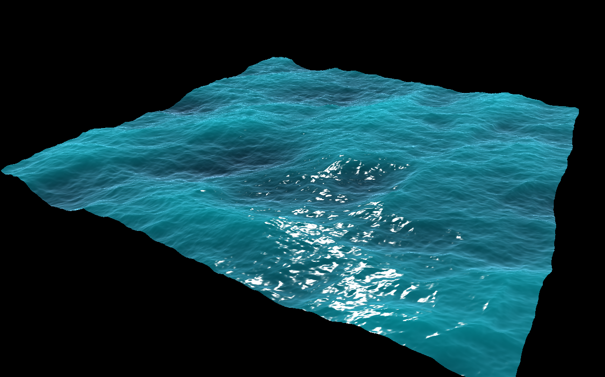
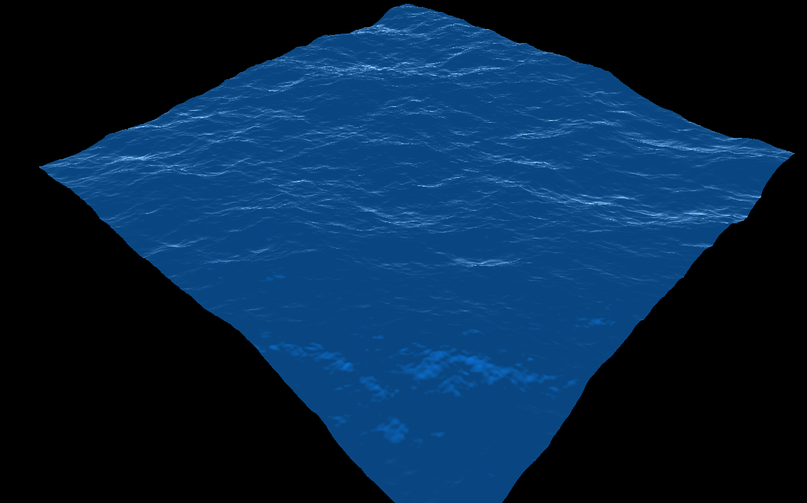

# FFTOceanSurface
This project is based on [OceanSurface](https://github.com/jiasli/OceanSurface).  
Original project uses FFTW library and CPU computing.  
If set a large resolution, the calculation would become slow.  
This project has been changed to using compute shader.

这个项目基于[OceanSurface](https://github.com/jiasli/OceanSurface)。  
原项目使用的FFTW库，通过CPU进行计算，如果设置较大的分辨率，计算会变得很慢。  
这个项目修改为使用计算着色器通过GPU计算。  
  
使用原项目光照：  
  
  
  
简单Blinn-Phong+Fresnel光照：  
  
  
